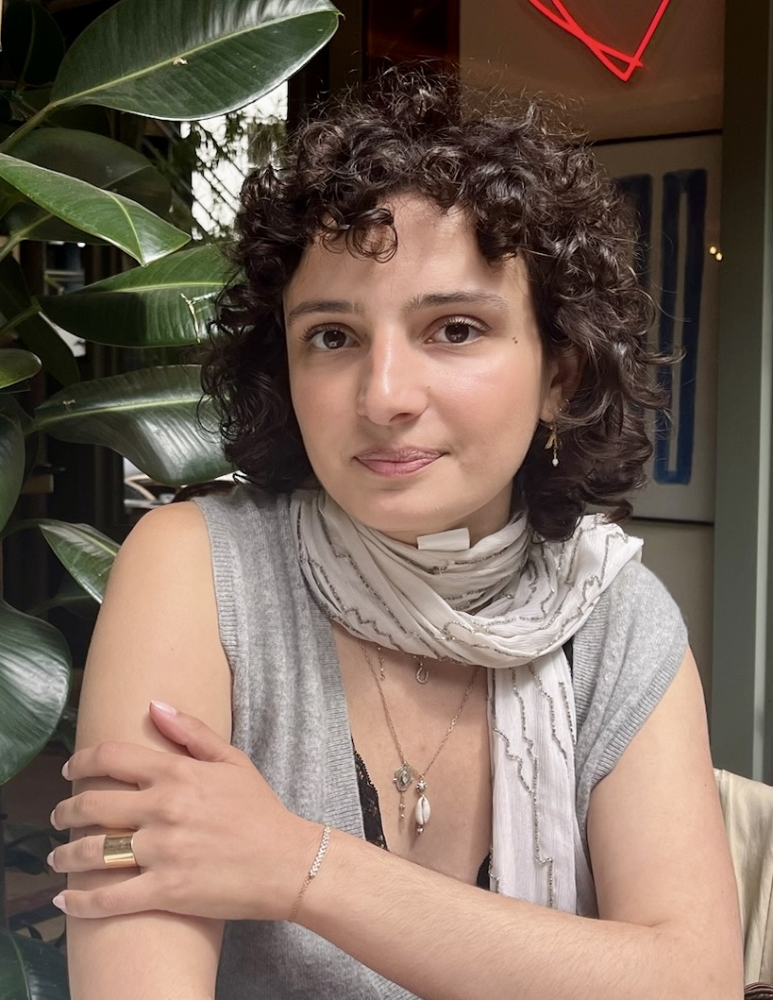

::: {.grid}

::: {.g-col-12 .g-col-md-4}
{style="border-radius: 15px; width: 100%; max-width: 250px;"}

 
[Email](mailto:anouckbutraud@gmail.com){.btn .btn-outline-secondary .btn-sm}
[LinkedIn](https://www.linkedin.com/in/anouck-butraud-assathian-376322184/){.btn .btn-outline-secondary .btn-sm}
[Google Scholar](https://scholar.google.com/citations?user=5dZ0b24AAAAJ&hl=fr){.btn .btn-outline-secondary .btn-sm}
:::

::: {.g-col-12 .g-col-md-8}

Je suis doctorante en économie, rattachée à la Chaire PcEn (Pluralisme culturel et Éthique du numérique) et au CES (Centre d'Économie de la Sorbonne, Université Paris 1 Panthéon-Sorbonne).

Mes recherches portent principalement sur les modes d'accès à la culture numérique et sur la transformation des industries audiovisuelles et musicales sous l'influence des technologies numériques, notamment de l’IA.

***

I am a PhD Student in Economics, affiliated to the Chair PcEn (Cultural pluralism and Digital ethics) and the CES (Sorbonne Center of Economics, University of Paris 1).

My research focuses primarily on modes of access to digital culture and on the transformation of the audiovisual and music industries under the influence of digital technology.

:::

:::

 

---

### Research projects - Recherche
***En cours*** : 

La fabrique des contenus synthétiques : l'emergence d'un marché. 

La concentration dans le live musical en France. 

[Voir tous les projets / See all projects ➔](research.qmd){.btn .btn-outline-primary .btn-sm}

 

### Communication & conferences
***A venir*** : 

**2026 Digital Publics Conference** : The synthetic content Factory. Zurich, Suisse (21-23 Octobre).

**2026 Masterclass Arte** : Comparative Analysis of Movie Catalogs. Paris, France. 

[Voir toutes les conférences / See all conferences ➔](communications.qmd){.btn .btn-outline-primary .btn-sm}

 

### Teaching - Enseignement
***A venir*** : 

**2026** Chargé de cours - Analyse de données (Data analysis) - M2 Économie de la Culture et du Numérique - Université Paris 1 Panthéon-Sorbonne

**2025-2026** Chargé de cours - Scraping de données (Data analysis) - M2 Économie de la Culture et du Numérique - Université Paris 1 Panthéon-Sorbonne

[Voir les cours / See teaching ➔](teaching.qmd){.btn .btn-outline-primary .btn-sm}